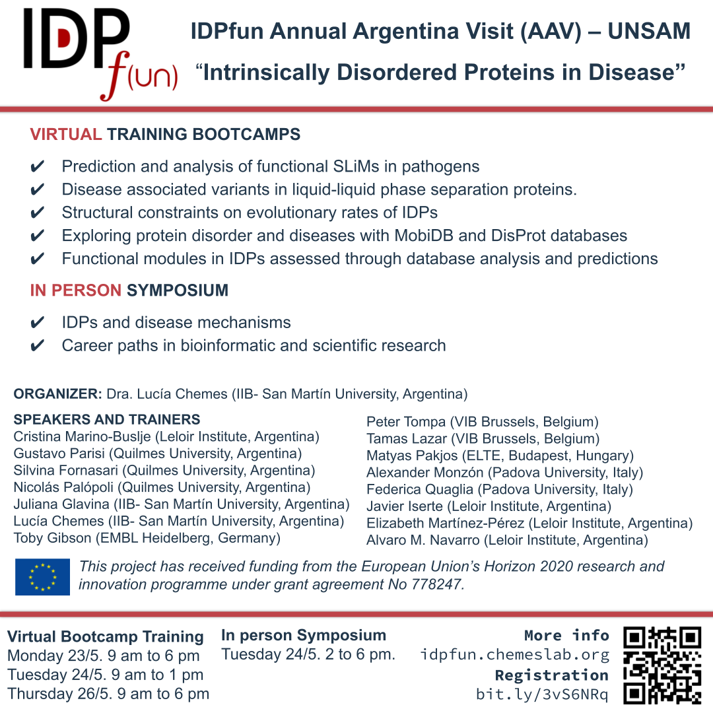

---
# Feel free to add content and custom Front Matter to this file.
# To modify the layout, see https://jekyllrb.com/docs/themes/#overriding-theme-defaults

title: IDPfun Annual Argentina Visit (AAV) – UNSAM
subtitle: Intrinsically Disordered Proteins in Disease
layout: page
show_sidebar: false
menubar: contents
hero_height: is_small
---
## ACKNOWLEDGEMENT

<table>

    <tr>
        <td width="100">
            
        </td>

        <td>
            <em>This project has received funding from the European Union’s Horizon 2020 research and innovation programme under grant agreement No 778247.</em>
        </td>
    </tr>

</table>

<!---

--->